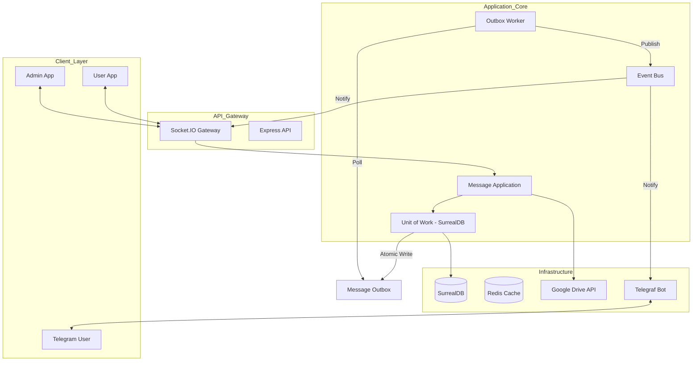

# Chat-Community

Hệ thống chat cộng đồng thời gian thực được xây dựng trên nền tảng **Clean Architecture** và **Event-Driven Design**. Dự án tập trung vào tính tin cậy của dữ liệu (Outbox Pattern) và khả năng tích hợp đa kênh (Websocket, Telegram).

## 🏗️ System Architecture



## 🚀 Tech Stack

- **Runtime**: Node.js + TypeScript
- **Database**: SurrealDB (Multi-model database)
- **Real-time**: Socket.IO
- **Caching**: Redis
- **File Storage**: Google Drive API
- **Framework**: Express.js
- **Bot Engine**: Telegraf (Telegram Bot API)

## ✨ Key Features & Patterns

- **Clean Architecture**: Phân tách rõ ràng giữa Domain, Application và Infrastructure.
- **Transactional Outbox Pattern**: Đảm bảo tin nhắn luôn được gửi đi ngay cả khi hệ thống Socket/Telegram gặp sự cố tạm thời.
- **Unit of Work**: Quản lý transaction nguyên tử trên SurrealDB.
- **Session Management**: Cơ chế "Graceful Disconnect" (F5/Reconnect) tránh spam thông báo online/offline.
- **File Processing**: Upload và quản lý file thông qua Google Drive Service Account.
- **Telegram Integration**: 
    - Tự động notify cho Admin khi có tin nhắn mới mà admin đang offline.
    - Bot hỗ trợ tạo Poll (Badminton, Boardgame) trực tiếp.

## 🛠️ Installation

1. Copy `.env.example` thành `.env.development`.
2. Cấu hình SurrealDB và Redis.
3. Cấu hình Telegram Bot Token & Google Service Account (nếu dùng upload).
4. Chạy lệnh:
```bash
npm install
npm run dev
```

## Monitoring

Ứng dụng expose Prometheus metrics tại `GET /metrics` khi
`METRICS_ENABLED=true`.

```bash
npm run dev
npm run monitoring:up
```

- Prometheus: http://localhost:9090
- Grafana: http://localhost:3001 (`admin` / `admin`)
- Dashboard: `Chat Community / Chat Community Overview`

Prometheus mặc định scrape API qua `host.docker.internal:3000`, phù hợp khi app
Node.js chạy trên máy host và Prometheus chạy trong Docker Desktop.
